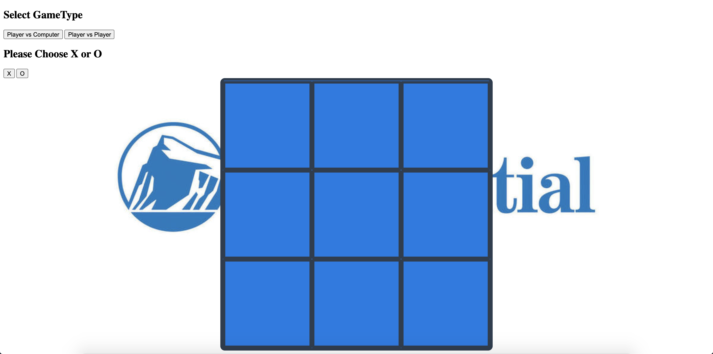

# Description
TicTacToe for Prudential Full Stack Academy

## What your project is / should be used for
This project should be used to demonstrate that I am proficient in Javascript, HTML and CSS fundamentals. As a secondary function it should be used for entertainment.

## What problem(s) your projects solves
This TicTacToe game solves the problem of two people desiring a friendly competition but not having access to any games.

## Brief Example

### This could be a code snippet showing how your project should be used (if it is meant to be integrated into another app)

### This could be a screenshot of your project running in the browser (if it is a stand-alone application)

# List of Features / User Stories

* As a user, I should be able to start a new tic tac toe game
* As a user, I should be able to click on a square to add X first and then O, and so on
* As a user, I should be shown a message after each turn for if I win, lose, tie or who's turn it is next
As a user, I should not be able to click the same square twice
* As a user, I should be shown a message when I win, lose or tie
* As a user, I should not be able to continue playing once I win, lose, or tie
* As a user, I should be able to play the game again without refreshing the page

# List of Technologies Used

*This project uses HTML, CSS, and Vanilla Javacsript

Often you will want to list the technologies you used to create the project.
This typically would consist of all primary languages, frameworks, and libraries your app is composed of

This is particularly important when it comes to recruiters scanning your projects for keywords
I
# Installation Instructions / Getting Started

*In order to run this application, simply 1) Fork 2) Clone 3) open index.html in your browser and have fun!

This section should walk a reader, step by step, through the process of setting up your project

For a tool meant to be integrated into other projects, this would likely outline the process of installing and accessing this tool in your project

For an application, this would likely outline the process of forking, cloning, and starting the app locally

# Contribution Guidelines

[Github](https://github.com/GDS83192/ticTacToe)

