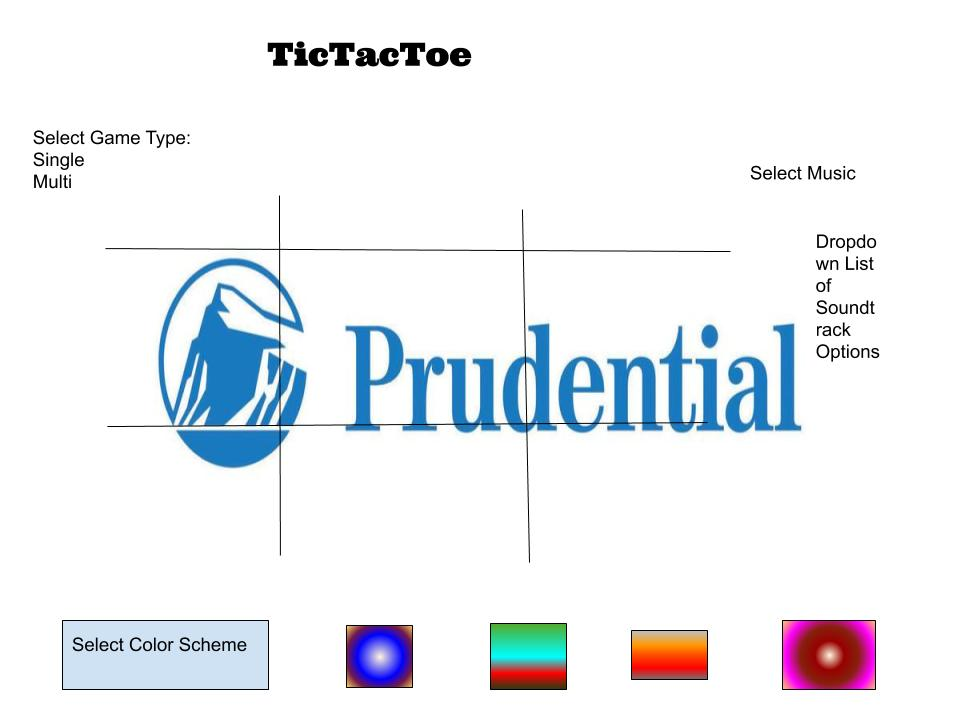
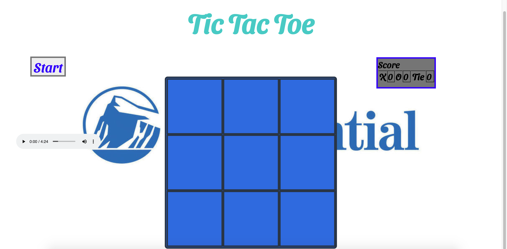

# Description
This is a TicTacToe Application Built for Project 1 of Prudential Full Stack Academy. 

* Link to game https://gds83192.github.io/ticTacToe/

## What is this application used for?
This project should be used be used for entertainment. The second purpose of this application is to demonstrate profiency in Javascript, HTML and CSS fundamentals to my employer.

## Technologies

1. Code versioning and control tools:
    1. Git: Used to track application code changes.
    2. Github: Online integrated tool used for storing the Git Repository for this application.

2. Developer tools:
    1. Visual Studio Code: Writing HTML, CSS and Javascript code.
    2. Google Chrome Developer tools: Troubleshooting and debugging.
    3. Google Chrome Browser: Displaying the application.

3. Wireframing:
    1. Google Draw, used to design the UI. 
    2. 

# What problem(s) your projects solves
This TicTacToe game solves the problem of two people desiring a friendly competition but not having access to any games.

# Approach
1. Control Flow: There are 9 Win Conditions. The 9 possible board scenarios that can result in a win are checked for using a function after each turn.

2. Event Listeners:
    1. Start Button: Checks if a game is underway. If it is a new game, the Start Button alerts that "X" goes first, otherwise it alerts that the game is already underway.

    2. Game Boxes: Each board cell has an event listener for click events: 
        1. Each cell is filled with an X or an O depending on whether it is an even or odd turn using a fillInBoxes function.
        2. A turn counter displayed below the board displays whether it is Player 1 or 2's turn depending on whether a click event was successfully registered. Box click events are only successful if the box does not already contain a player token.
        3. A score keeper display incremements depending on whether x or won, or the game was a tie. On each click of a box a winCheck function runs, and based on checking for win conditions or a tie, resets the game and incrememts the score keeper if the game is over.   

## Brief Example

# List of Features / User Stories

* As a user, I should be able to start a new tic tac toe game
* As a user, I should be able to click on a square to add X first and then O, and so on
* As a user, I should be shown a message after each turn for if I win, lose, tie or who's turn it is next
* As a user, I should not be able to click the same square twice
* As a user, I should be shown a message when I win, lose or tie
* As a user, I should not be able to continue playing once I win, lose, or tie
* As a user, I should be able to play the game again without refreshing the page

# Installation Instructions / Getting Started

In order to run this application, simply:
1. Fork 
2. Clone 
3. Open index.html in your browser and have fun!

# Contribution Guidelines

[Github](https://github.com/GDS83192/ticTacToe) ---- https://github.com/GDS83192/ticTacToe

# Future Plans

1. Allow user to select from a panel of color schemes.

2. Include a soundtrack for users to choose music while playing.

3. Add AI functionality for users to play against the computer. 

4. Utilize localStorage to allow games to continue after page refresh or loss of internet connectivity.
    1. https://developer.mozilla.org/en-US/docs/Web/API/Window/localStorage
5. Allow players to customize their tokens.

6. Allow 2 players to compete against each other online.
