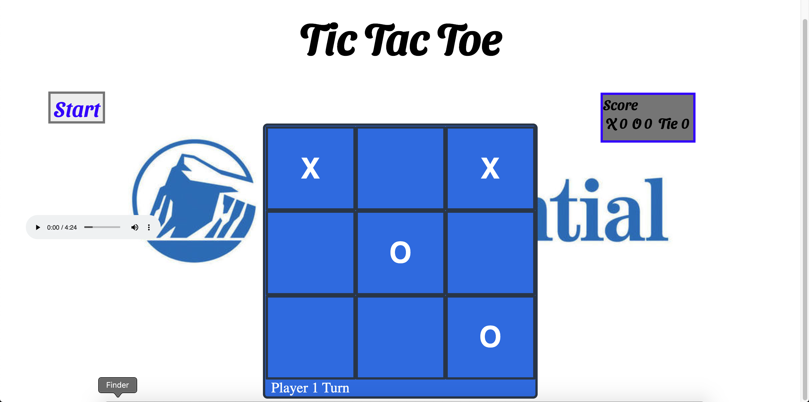

# Description
TicTacToe Application Build for Project 1 of Prudential Full Stack Academy

## What is this application used for?
This project should be used to demonstrate that I am proficient in Javascript, HTML and CSS fundamentals. As a secondary function it should be used for entertainment.

## What problem(s) your projects solves
This TicTacToe game solves the problem of two people desiring a friendly competition but not having access to any games.

## Brief Example

# List of Features / User Stories

* As a user, I should be able to start a new tic tac toe game
* As a user, I should be able to click on a square to add X first and then O, and so on
* As a user, I should be shown a message after each turn for if I win, lose, tie or who's turn it is next
As a user, I should not be able to click the same square twice
* As a user, I should be shown a message when I win, lose or tie
* As a user, I should not be able to continue playing once I win, lose, or tie
* As a user, I should be able to play the game again without refreshing the page

# List of Technologies Used

*This project uses HTML, CSS, and Vanilla Javacsript

# Installation Instructions / Getting Started

*In order to run this application, simply 1) Fork 2) Clone 3) open index.html in your browser and have fun!

# Contribution Guidelines

[Github](https://github.com/GDS83192/ticTacToe) ---- https://github.com/GDS83192/ticTacToe

